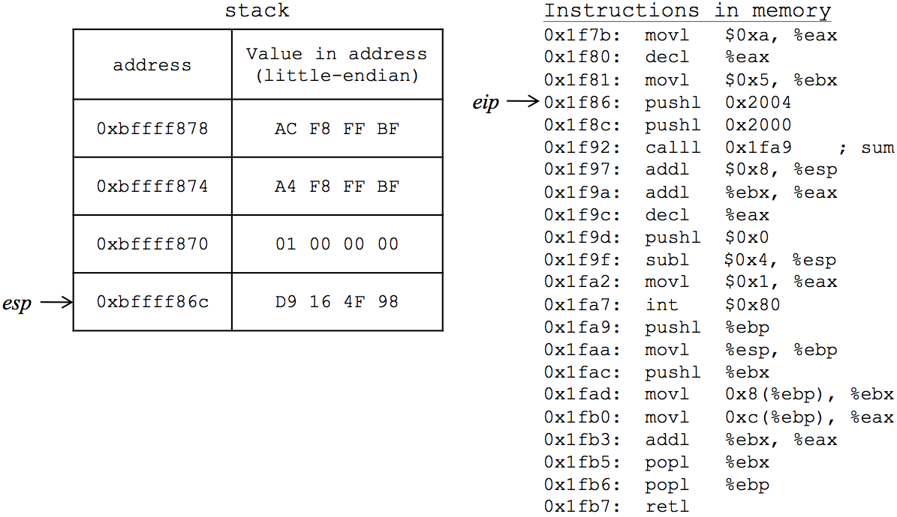

# cdecl (32-bit) - Function Overview Supplement

#### Here we provide a few more syntax examples of the function overview in Chapter 6.

In Chapter 6, to illustrate function calling conventions, we provide a walkthrough of 32-bit cdecl with our Sum program (Program 6.1). The detailed walkthrough in the book uses the **GAS (AT&T) syntax on macOS**, and the "Instructions in memory" in Figures 6.2 - 6.6 is the disassembly with LLVM in Xcode (e.g., Figure 6.2).

**Figure 6.2**

What follows are Program 6.1 stack and disassembly examples for more environments.

### Linux - Program 6.1

<table>
<tr>
<th>GAS</th>
<th>NASM</th>
</tr>
<tr>
<td><pre style="border:0">
.data
num1: .long 2
num2: .long 4

.text
.globl _main, _sum
_main:

mov $10, %eax
dec %eax
mov $5, %ebx

push num2
push num1
call _sum
add $8, %esp

add %ebx, %eax
dec %eax

mov $1, %eax
mov $0, %ebx
int $0x80

_sum:
push %ebp
mov %esp, %ebp
push %ebx
mov 8(%ebp), %ebx
mov 12(%ebp), %eax
add %ebx, %eax
pop %ebx
pop %ebp
ret
.end
</pre></td>
<td valign="top"><pre style="border:0">
section .data
num1: dd 2
num2: dd 4

section .text
global _main, _sum
_main:

mov eax, 10
dec eax
mov ebx, 5

push DWORD[num2]
push DWORD[num1]
call _sum
add esp, 8

add eax, ebx
dec eax

mov eax, 1
mov ebx, 0
int 80h

_sum:
push ebp
mov ebp, esp
push ebx
mov ebx, [ebp + 8]
mov eax, [ebp + 12]
add eax, ebx
pop ebx
pop ebp
ret</td></pre></tr>
</table>

### Linux - Program 6.1 Disassembly

Notice that the disassembly is in AT&T syntax by default in GDB on Linux, even when the NASM assembler (with Intel syntax) is used to assemble the code. You can set GDB to use Intel syntax with the `set disassembly-flavor intel` command. Though the exact memory addresses may be different at program runtime, the code and disassembly are identical in GAS and NASM on Linux.

*Refer to the following disassembly for the addresses used in Figures 6.2 - 6.6 below!*

<table>
<tr>
<th>GAS</th>
<th>NASM</th>
</tr>
<tr>
<td><pre style="border:0">
Breakpoint 1, 0x08048074 in _main ()
<b>(gdb) disassemble _main</b>
Dump of assembler code for function _main:
=> 0x08048074 <+0>:	mov    $0xa,%eax
   0x08048079 <+5>:	dec    %eax
   0x0804807a <+6>:	mov    $0x5,%ebx
   0x0804807f <+11>:	pushl  0x80490b5
   0x08048085 <+17>:	pushl  0x80490b1
   0x0804808b <+23>:	call   0x80480a2 <_sum>
   0x08048090 <+28>:	add    $0x8,%esp
   0x08048093 <+31>:	add    %ebx,%eax
   0x08048095 <+33>:	dec    %eax
   0x08048096 <+34>:	mov    $0x1,%eax
   0x0804809b <+39>:	mov    $0x0,%ebx
   0x080480a0 <+44>:	int    $0x80
End of assembler dump.
<b>(gdb) disassemble _sum</b>
Dump of assembler code for function _sum:
   0x080480a2 <+0>:	push   %ebp
   0x080480a3 <+1>:	mov    %esp,%ebp
   0x080480a5 <+3>:	push   %ebx
   0x080480a6 <+4>:	mov    0x8(%ebp),%ebx
   0x080480a9 <+7>:	mov    0xc(%ebp),%eax
   0x080480ac <+10>:	add    %ebx,%eax
   0x080480ae <+12>:	pop    %ebx
   0x080480af <+13>:	pop    %ebp
   0x080480b0 <+14>:	ret    
End of assembler dump.
</pre></td>
<td valign="top"><pre style="border:0">
Breakpoint 1, 0x08048080 in _main ()
<b>(gdb) disassemble _main</b>
Dump of assembler code for function _main:
=> 0x08048080 <+0>:	mov    $0xa,%eax
   0x08048085 <+5>:	dec    %eax
   0x08048086 <+6>:	mov    $0x5,%ebx
   0x0804808b <+11>:	pushl  0x80490c4
   0x08048091 <+17>:	pushl  0x80490c0
   0x08048097 <+23>:	call   0x80480ae <_sum>
   0x0804809c <+28>:	add    $0x8,%esp
   0x0804809f <+31>:	add    %ebx,%eax
   0x080480a1 <+33>:	dec    %eax
   0x080480a2 <+34>:	mov    $0x1,%eax
   0x080480a7 <+39>:	mov    $0x0,%ebx
   0x080480ac <+44>:	int    $0x80
End of assembler dump.
<b>(gdb) disassemble _sum</b>
Dump of assembler code for function _sum:
   0x080480ae <+0>:	push   %ebp
   0x080480af <+1>:	mov    %esp,%ebp
   0x080480b1 <+3>:	push   %ebx
   0x080480b2 <+4>:	mov    0x8(%ebp),%ebx
   0x080480b5 <+7>:	mov    0xc(%ebp),%eax
   0x080480b8 <+10>:	add    %ebx,%eax
   0x080480ba <+12>:	pop    %ebx
   0x080480bb <+13>:	pop    %ebp
   0x080480bc <+14>:	ret    
End of assembler dump.
</pre></td>
</tr>
</table>

##### Figure 6.2 - Before paramters pushed
<table>
<tr>
<td><strong>GAS (eip -> 0x0804807f)</strong></span</th>
<td><pre style="border:0"><b>(gdb) x/8xw $esp</b>
0xffffd1d0:	0x00000001	0xffffd392	0x00000000	0xffffd3aa
0xffffd1e0:	0xffffd3b5	0xffffd3c7	0xffffd3f7	0xffffd40d
</td>
</tr>
<tr>
<td style="font-size:10pt;"><strong>NASM (eip -> 0x0804808b)</strong></td>
<td><pre style="border:0"><b>(gdb) x/8xw $esp</b>
0xffffd1c0:	0x00000001	0xffffd38f	0x00000000	0xffffd3a8
0xffffd1d0:	0xffffd3b3	0xffffd3c5	0xffffd3f5	0xffffd40b
</td>
</tr>
</table>

##### Figure 6.3 - After parameters pushed
Notice the parameters (2 and 4) on the stack.
<table>
<tr>
<th style="font-size:10pt">GAS (eip -> 0x0804808b) </th>
<td><pre style="border:0"><b>(gdb) x/8xw $esp</b>
0xffffd1c8:	0x00000002	0x00000004	0x00000001	0xffffd392
0xffffd1d8:	0x00000000	0xffffd3aa	0xffffd3b5	0xffffd3c7  </td>
</tr>
<tr>
<th style="font-size:10pt">NASM (eip -> 0x08048097)</th>
<td><pre style="border:0"><b>(gdb) x/8xw $esp</b>
0xffffd1b8:	0x00000002	0x00000004	0x00000001	0xffffd38f
0xffffd1c8:	0x00000000	0xffffd3a8	0xffffd3b3	0xffffd3c5  </td>
</tr>
</table>

##### Figure 6.4 - After CALL instruction
Notice the return address (i.e., the memory address after the CALL) is automatically pushed on the stack.
<table>
<tr>
<th style="font-size:10pt">GAS (eip -> 0x080480a2) </th>
<td><pre style="border:0"><b>(gdb) x/8xw $esp</b>
0xffffd1c4:	0x08048090	0x00000002	0x00000004	0x00000001
0xffffd1d4:	0xffffd392	0x00000000	0xffffd3aa	0xffffd3b5  </td>
</tr>
<tr>
<th style="font-size:10pt">NASM (eip -> 0x080480ae </th>
<td><pre style="border:0"><b>(gdb) x/8xw $esp</b>
0xffffd1b4:	0x0804809c	0x00000002	0x00000004	0x00000001
0xffffd1c4:	0xffffd38f	0x00000000	0xffffd3a8	0xffffd3b3  </td>
</tr>
</table>

##### Figure 6.5 - After establishing frame and saving ebx
Notice that Linux automatically separates the stack frames with a 0x0 and then pushes ebx (5) on the stack.
<table>
<tr>
<th style="font-size:10pt">GAS (eip -> 0x080480a5) </th>
<td><pre style="border:0"><b>(gdb) x/8xw $esp</b>
0xffffd1bc:	0x00000005	0x00000000	0x08048090	0x00000002
0xffffd1cc:	0x00000004	0x00000001	0xffffd392	0x00000000  </td>
</tr>
<tr>
<th style="font-size:10pt">NASM (eip -> 0x080480b1 </th>
<td><pre style="border:0"><b>(gdb) x/8xw $esp</b>
0xffffd1ac:	0x00000005	0x00000000	0x0804809c	0x00000002
0xffffd1bc:	0x00000004	0x00000001	0xffffd38f	0x00000000  </td>
</tr>
</table>

##### Figure 6.6 - After RET instruction
Notice that execution jumped to the addresses implicitly pushed on the stack with the CALL instruction (Figure 6.4). Now, what remains is the need to clean up stack (the parameters that were pushed: 2 and 4).
<table>
<tr>
<th style="font-size:10pt">GAS (eip -> 0x08048090) </th>
<td><pre style="border:0"><b>(gdb) x/8xw $esp</b>
0xffffd1c8:	0x00000002	0x00000004	0x00000001	0xffffd392
0xffffd1d8:	0x00000000	0xffffd3aa	0xffffd3b5	0xffffd3c7  </td>
</tr>
<tr>
<th style="font-size:10pt">NASM (eip -> 0x0804809c) </th>
<td><pre style="border:0"><b>(gdb) x/8xw $esp</b>
0xffffd1b8:	0x00000002	0x00000004	0x00000001	0xffffd38f
0xffffd1c8:	0x00000000	0xffffd3a8	0xffffd3b3	0xffffd3c5  </td>
</tr>
</table>
 

### MASM on Windows

Coming soon!