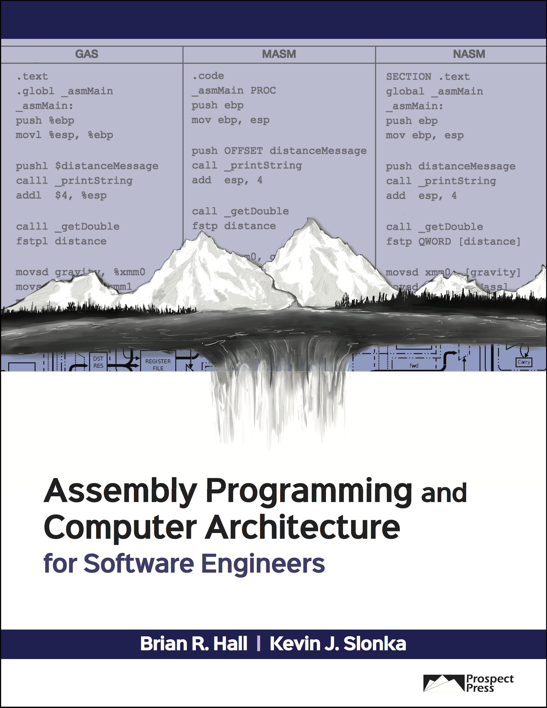

# Assembly Programming and Computer Architecture for Software Engineers (APCASE)

#### * Code Repository - some assembly required...git it? *

## About


Welcome to the code repository for our book! *APCASE* is a very practical and comprehensive educational text for students, educators, and professionals seeking to learn about Assembly programming and computer architecture. But what makes our book helpful and unique?

- Based on x86 and x86_64 architecture.
- All programming examples are provided for three common assemblers: GAS (Clang/LLVM), MASM, and NASM, which ensures both AT&T and Intel syntax. This allows for learning on any OS platform: Mac, Windows, and Linux.
- Context and examples provided in both 32-bit and 64-bit, both of which are useful for a programmer.
- Code-oriented and detailed overviews of function calls, floating-point operations (x87 through AVX), inline Assembly, and system calls, all in one book.
- Brief introduction and code examples for other modern architectures like ARM, AVR, RISC-V, and z/Architecture.
- The Appendices provide practical information and guide students in learning Assembly programming.
- Chapter Supplements provide a deeper dive on topics as necessary.
- [Links](./Book_Links.md) to wikis, developer resources, and videos are provided to assist in further exploration of topics.
- Attention, Programming, and Learning notes are placed throughout the text to guide the reader in beneficial ways.

| [Prospect Press](http://www.prospectpressvt.com/) | eBook ([comparison](./FAQ/README.md#eBook)) | Print Book (306 pages) |
|----------------|-------|------------|
| Price     | $44 | $68 |
| Sources   | [Redshelf.com](https://www.redshelf.com/book/742712/assembly-programming-and-computer-architecture-for-software-engineers-742712-9781943153312-brian-r-hall-and-kevin-j-slonka), [Vital Source](https://www.vitalsource.com/products/assembly-programming-and-computer-architecture-for-brian-r-hall-and-kevin-j-v9781943153312) | [Amazon](https://www.amazon.com/dp/1943153329), [Amazon Europe](https://www.amazon.de/Assembly-Programming-Computer-Architecture-Engineers/dp/1943153329/), [Redshelf.com](https://www.redshelf.com/book/742712/assembly-programming-and-computer-architecture-for-software-engineers-742712-9781943153312-brian-r-hall-and-kevin-j-slonka) |
| ISBN      | 978-1-943153-31-2 | 978-1-943153-32-9 |

Is this book for you? Checkout the [Preface](./content/Assembly_Preface_GitHub.pdf), a free [Chapter 3: Assembly and Syntax Fundamentals](./content/Assembly_Ch_3_GitHub.pdf), and the free [Appendices](#appendices).

---

### Chapter Roadmap


---

<a name="appendices"></a>
### Appendices
Appendices A, B, E, and I are available for free.

- Introduction to the Appendices
- [Appendix A: Assembly Translation](./content/Assembly_App_A_GitHub.pdf)
- [Appendix B: Environment Setup](./content/Assembly_App_B_GitHub.pdf)
- Appendix C: Disassembly
- Appendix D: Command-Line Debugging Assembly with GDB
- [Appendix E: Linking Assembly and C++](./content/Assembly_App_E_GitHub.pdf)
- Appendix F: Functions and Stack
- Appendix G: Using CPUID
- Appendix H: ASCII and Decimal Arithmetic
- [Appendix I: Intrinsics](./content/Assembly_App_I_GitHub.pdf)


---

### Links

- Book Website (@ProspectPressVT): [http://www.prospectpressvt.com/titles/hall-assembly-programming/](http://www.prospectpressvt.com/titles/hall-assembly-programming/)
- YouTube Channel (Book Videos): [https://www.youtube.com/channel/UCr0svQEez3UQvlj6-5EYS6w](https://www.youtube.com/channel/UCr0svQEez3UQvlj6-5EYS6w)
- Brian's Website: [http://www.brianrhall.net](http://www.brianrhall.net)
- Kevin's Website: [http://www.kevinslonka.com](http://www.kevinslonka.com)
- Organized collection of all links in APCASE: [Book_Links.md](./Book_Links.md)

---

### Citing this Book

When citing code snippets or other content from the repository or book, please cite the original source:

**BibTeX**:

```
@Book{APCASE,
author = {Hall, B. R. and Slonka, K. J.},
title = {Assembly Programming and Computer Architecture for Software Engineers},
publisher = {Prospect Press},
year = {2018},
address = {Burlington, VT},
isbn = {978-1-943153-32-9}
}
```

**APA**:

Hall, B. R. & Slonka, K. J. (2018). *Assembly Programming and Computer Architecture for Software Engineers*. Burlington, VT: Prospect Press.

---


## [FAQ](./FAQ/README.md)

***Important Notes***

- **The macOS 10.14 SDK and later no longer support 32-bit applications. If you want to write 32-bit programs for i386 on macOS, Xcode 9.4 or earlier is required.** If you are using macOS High Sierra (10.3) and XCode 9 or later, you will discover that the i386 architecture is deprecated. We have provided both 32-bit and 64-bit programs in most instances. In the next edition, 64-bit programs will likely replace many of the 32-bit programs for teaching concepts. We won't remove the 32-bit programs from GitHub, but the text will use the newer 64-bit programs for the examples. **In the meantime, both 32-bit and 64-bit programs are available for learning.**

***Book***

- [Why learn Assembly? Is it even used anymore?](./FAQ/README.md#why)
- [Why x86? Is it too complex for students?](./FAQ/README.md#x86)
- [Why have code for multiple assemblers? Is it confusing?](./FAQ/README.md#assemblers)
- [Why no custom software (e.g., libraries, macros, environments)?](./FAQ/README.md#software)
- [Is the GAS and Clang/LLVM code for macOS or Linux?](./FAQ/README.md#GAS)
- [What if a web link in the book is broken? / Is there a place with all active web links?](./FAQ/README.md#book_links)
- [What if students or instructors want to be able to perform console I/O before Chapter 6 and/or Chapter 10?](./Materials/Console\_IO/)
- [Are there various syntax examples of the Chapter 6 detailed cdecl walkthough?](./Materials/cdecl/README.md)
- [Which provider should I choose for the eBook?](./FAQ/README.md#eBook)

***Teaching***

- [How do the authors pace a semester using the text? / Is there an example course outline?](./Materials/WeeklyOutlineExample/)
- [Chapter Highlights - What is most important, what do students typically struggle with, and what should students not forget for each chapter?](./Materials/ChapterHighlights/README.md)

***Programming***

- [How do I assemble and link on Linux?](./FAQ/README.md#linux)
- [How do I assemble and link on macOS (Terminal)?](./FAQ/README.md#mac)
- [Do I use the .globl or .global directive for *main* in GAS?](./FAQ/README.md#global)
- [How do I use GDB or LLDB for command-line debugging?](./Materials/GDB\_LLDB/)

---

## Errata
- **Chapter 4, p. 76, Program 4.4 - NASM**:
the line `mov eax, array` should be `mov eax, [array]`. Fixed in repository.
- **Chapter 5, p. 95, Code Review**:
JNG description should be "Jump if **not** greater (signed)". This is correct on p. 88.
- **Chapter 6, p. 98, 8th bullet point**: <br>*Incorrect*: "The least significant byte is stored at the start of the address (higher) and the most significant byte is stored at the end (lower)."
<br>*Correct*: "The least significant byte is stored at the start of the address (lower physcial address) and the most significant byte is stored at the end (higher physical address)."
- **Chapter 6, pp. 102-105, Figures 6.2 - 6.6**: the line under *Instructions in memory* `0x1fa7: int $-0x80` was the disassembly visual output (and a bug) in versions of Xcode/LLVM at the time of writing the 1st Edition. The negative sign is incorrect. The bug has since been fixed and the figures will be updated in the next edition update to `0x1fa7: int $0x80`.
- **Chapter 7, p. 122, CMPS (si and di registers flipped)**:
<br>*Incorrect*: "CMPS compares each corresponding character by performing an implicit subtraction of the character referenced by **(r/e)di** from the character referenced by **(r/e)si**..."
<br>*Correct*: "CMPS compares each corresponding character by performing an implicit subtraction of the character referenced by **(r/e)si** from the character referenced by **(r/e)di**..."
- more errors yet to be found...

## Contact
We are very happy to answer any questions or consider suggestions you might have about the text. Just email one of us! <br>
<a href="mailto:hall@champlain.edu">Brian</a> (author) or <a href="mailto:beth.golub@prospectpressvt.com">Beth</a> (publisher)
